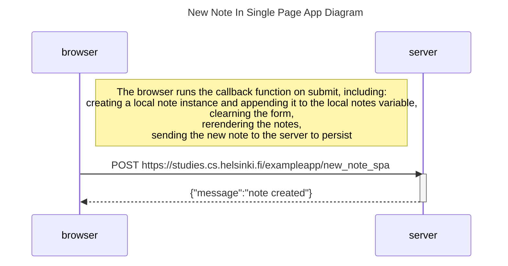

```mermaid
---
title: New Note In Single Page App Diagram
config:
  theme: default
---
sequenceDiagram
participant browser
participant server

    Note right of browser: The browser runs the callback function on submit, including:<br/> creating a local note instance and appending it to the local notes variable,<br/>clearning the form,<br/>rerendering the notes,<br/>sending the new note to the server to persist 
    browser->>server: POST https://studies.cs.helsinki.fi/exampleapp/new_note_spa
    activate server

    server-->>browser: {"message":"note created"}
    deactivate server
```